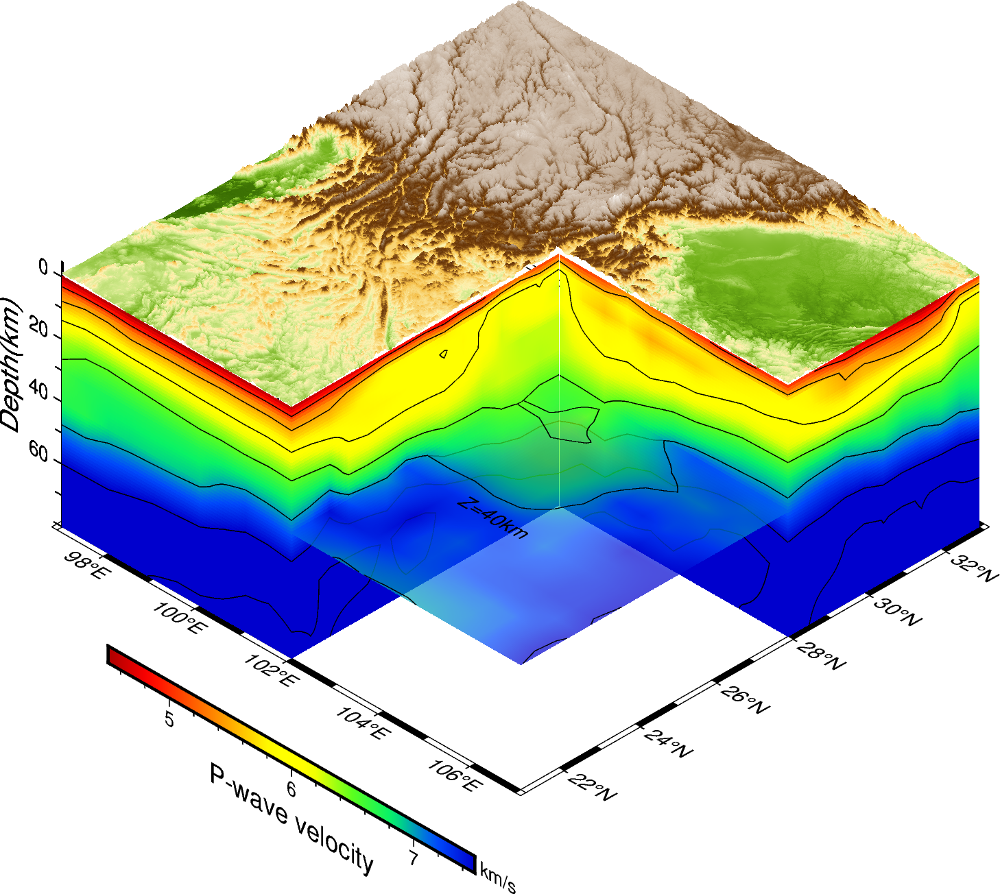

# PyGMT绘制三维剖面图
使用PyGMT对地震三维速度（lon,lat,dep,value）进行三维切片并绘制。
# 软件需求
```python
import pandas as pd 
import xarray as xr 
import pygmt
import numpy as np
```
## mapview_3Di.ipynb
使用的速度模型： 
https://github.com/ShouchengHan/USTClitho2.0/blob/main/USTClitho2.0.wrst.sea_level.txt
使用PyGMT提取三维切片并绘制三维速度模型，实现按照经纬度截取剖面，对地形按照一定的形状裁剪。



## mapview_3d_earthquake.ipynb
在上一个例子中增加地震分布剖面。地震数据：http://cses.ac.cn/sjcp/ggmx/2021/132.shtml


## pygmt 配置
高版本存在问题，建议是使用cubeplot绘制https://www.generic-mapping-tools.org/GMTjl_doc/documentation/utilities/cubeplot/
```raw
pygmt.show_versions()
PyGMT information:
  version: v0.9.0
System information:
  python: 3.8.19 | packaged by conda-forge | (default, Mar 20 2024, 12:38:07) [MSC v.1929 64 bit (AMD64)]
  executable: D:\miniconda3\envs\mtspec\python.exe
  machine: Windows-10-10.0.19045-SP0
Dependency information:
  numpy: 1.24.4
  pandas: 1.5.3
  xarray: 2023.1.0
  netCDF4: 1.6.4
  packaging: 23.1
  contextily: 1.5.0
  geopandas: 0.13.2
  ghostscript: 9.54.0
GMT library information:
  binary version: 6.4.0
  cores: 8
  grid layout: rows
  image layout: 
  library path: D:/miniconda3/envs/mtspec/Library/bin/gmt.dll
  padding: 2
  plugin dir: D:/miniconda3/envs/mtspec/Library/bin/gmt_plugins
  share dir: c:/programs/gmt6/share
  version: 6.4.0
```
